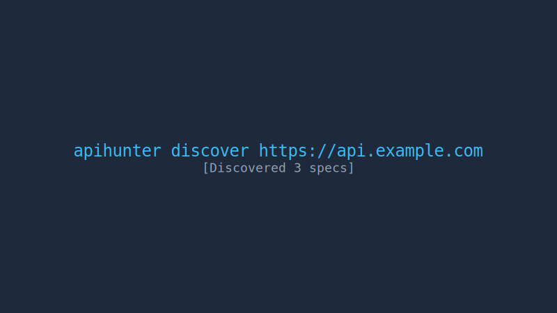
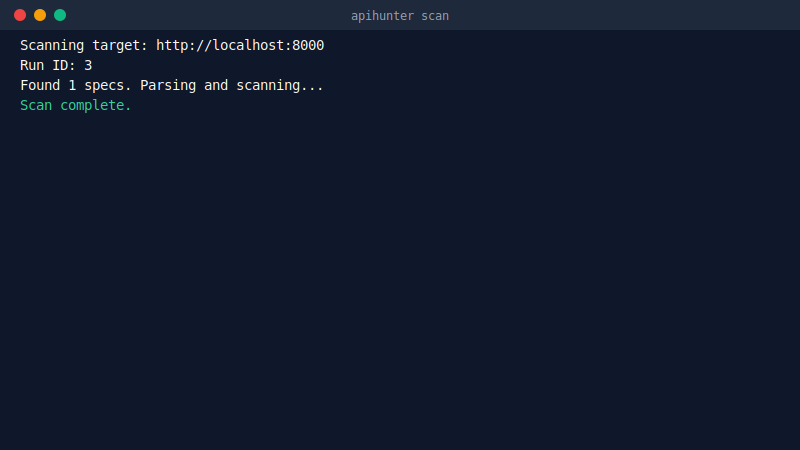
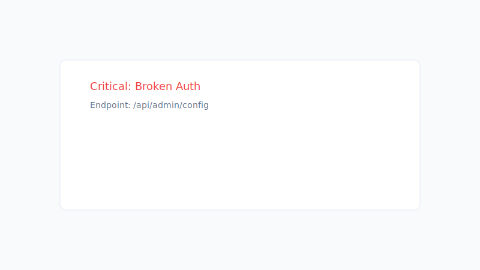
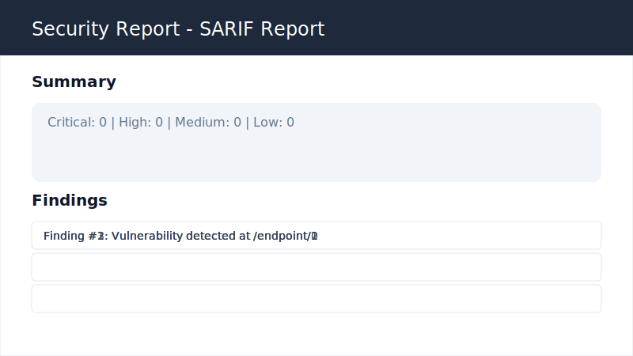
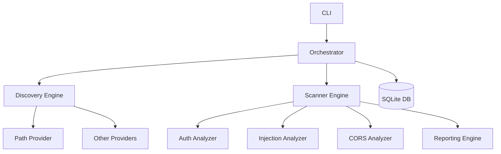

#  apihunter

[](https://pypi.org/project/apihunter/)
[](https://opensource.org/licenses/MIT)
[](https://pypi.org/project/apihunter/)
[](https://github.com/bess1lie/apihunter/actions)

<p align="center">
  
</p>

**apihunter** is a professional-grade, high-performance CLI tool designed for automated REST API security reconnaissance and vulnerability scanning. Part of the [bounty toolkit](https://github.com/bess1lie), it streamlines the discovery of API surfaces and the identification of critical security flaws.

[Explore Docs](#architecture) • [Report Bug](https://github.com/bess1lie/apihunter/issues) • [Contribute](#contributing)

---

## ✨ Features

- 🔍 **Automated Discovery**: Intelligent probing of well-known paths to uncover OpenAPI, Swagger, and GraphQL specifications.
- 🛡️ **Security Heuristics**: Automated detection of common API vulnerabilities, including injection flaws, broken access control, and info leaks.
- 📊 **Rich Reporting**: Generate professional-grade reports in **HTML**, **Markdown**, and **SARIF** formats for seamless integration with bug bounty workflows.
- 🚀 **High Performance**: Built on `httpx` and `asyncio` for lightning-fast, concurrent scanning.

---

## 🚀 Quick Start

### Installation

Install via `pip`:

```bash
pip install apihunter
```

### Discovery

Find all API entry points for a given target:

```bash
apihunter discover https://api.example.com
```



### Scanning

Run a full security audit:

```bash
apihunter scan https://api.example.com
```



### Reporting

Generate a beautiful HTML report from a scan run:

```bash
apihunter report <run_id> --format html
```






---

## 🛠 CLI Reference

| Command | Description |
| :--- | :--- |
| `discover` | Discovers API endpoints and specification documents. |
| `scan` | Executes automated security vulnerability scans. |
| `report` | Generates detailed reports (HTML, MD, SARIF). |
| `version` | Shows the current version of apihunter. |

---

## 🏗 Architecture

apihunter is built with a modular, provider-based architecture designed for extensibility.



- **Core**: Handles database management, HTTP client pooling, and configuration.
- **Discovery**: Injected providers probe targets for specification documents.
- **Modules**: Independent analyzers run specialized security checks.
- **Parser**: Robust parsing of OpenAPI/Swagger/GraphQL schemas.

---

## ⚙️ Configuration

Use a YAML configuration file to define scan scope and exclusions:

```yaml
# scope.yaml
targets:
  - https://api.example.com
exclude_extensions:
  - .png
  - .jpg
  - .css
deny:
  - https://api.example.com/admin/*
```

Run with scope:
```bash
apihunter scan https://api.example.com --scope-file scope.yaml
```

---

## 🗺 Roadmap

- [ ] **Advanced Discovery**: DNS-based and subdomain brute-force discovery.
- [ ] **GraphQL Specialized Engine**: Deep introspection and query injection.
- [ ] **Real-time Dashboard**: WebSocket-powered live scan monitoring.
- [ ] **Cloud Metadata Scanning**: Automated AWS/GCP/Azure metadata endpoint detection.

---

## 🤝 Contributing

Contributions make the open-source community an amazing place to learn, inspire, and create. We welcome your help!

1. Fork the Project
2. Create your Feature Branch (`git checkout -b feature/AmazingFeature`)
3. Commit your Changes (`git commit -m 'Add some AmazingFeature'`)
4. Push to the Branch (`git push origin feature/AmazingFeature`)
5. Open a Pull Request

Please read our [CONTRIBUTING.md](CONTRIBUTING.md) for details on our code of conduct and development process.

---

## 🔒 Security

If you discover a security vulnerability in this project, please **do not open a public issue**. Instead, report it privately via the security contact provided in [SECURITY.md](SECURITY.md).

---

## 📄 License

Distributed under the MIT License. See `LICENSE` for more information.

---

<p align="center">
  Made with ❤️ by <a href="https://github.com/bess1lie">bess1lie</a>
</p>
