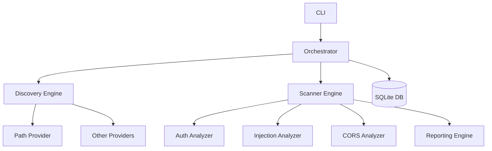

#  apihunter

[](https://pypi.org/project/apihunter/)
[](https://opensource.org/licenses/MIT)
[](https://pypi.org/project/apihunter/)
[](https://github.com/bess1lie/apihunter/actions)

<p align="center">
  
</p>

<p align="center">
  <strong>Automated REST API security testing CLI — OpenAPI discovery, auth analysis, and security heuristics.</strong>
</p>

<p align="center">
  <a href="https://github.com/bess1lie/apihunter/issues">Report Bug</a> •
  <a href="https://github.com/bess1lie/apihunter/contributing">Contribute</a> •
  <a href="https://github.com/bess1lie/apihunter/releases">Releases</a>
</p>

---

## 🚀 Overview

**apihunter** is a high-performance, modular security tool built for bug hunters and security engineers. It automs the most tedious parts of API reconnaissance: finding specification files, mapping endpoint structures, and identifying low-hanging fruit like weak authentication or information leaks.

Built with `asyncio` and `httpx`, it is designed to scale with your targets.

---

## ✨ Key Features

| Feature | Description |
| :--- | :--- |
| 🔍 **Smart Discovery** | Automatically finds OpenAPI, Swagger, and GraphQL specs. |
| 🛡️ **Heuristic Scanning** | Detects injection, IDOR, CORS misconfigs, and info leaks. |
| 🔐 **Auth Auditing** | Analyates authentication schemes and bypass potential. |
| 📊 **Professional Reports** | Outputs in HTML, Markdown, and SARIF for CI/CD integration. |
| ⚡ **Blazing Fast** | Fully asynchronous engine for massive concurrency. |

---

## 🛠 Quick Start

### Installation

```bash
pip install apihunter
```

### Basic Workflow

1. **Discover** endpoints and specs:
```bash
apihunter discover https://api.example.com
```


2. **Scan** for vulnerabilities:
```bash
apihunter scan https://api.example.com
```


3. **Generate** a report:
```bash
apihunter report <run_id> --format html
```


---

## 🏗 Architecture

apihunter utilizes a provider-based orchestration engine.



- **Discovery Engine**: Injects providers to probe target surfaces.
- **Scanner Engine**: Executes specialized analyzers against discovered endpoints.
- **Core**: Manly manages the database, HTTP client, and scope.

---

## ⚙️ Configuration

Control your scan via a `scope.yaml` file.

```yaml
targets:
  - https://api.example.com
exclude_extensions:
  - .png
  - .jpg
  - .css
deny:
  - https://api.example.com/admin/*
```

Run with scope:
```bash
apihunter scan https://api.example.com --scope-file scope.yaml
```

---

## 🗺 Roadmap

- [ ] **Advanced Discovery**: DNS and subdomain enumeration integration.
- [ ] **GraphQL Deep Scan**: Advanced query-based injection testing.
- [ ] **Live Dashboard**: Real-time web UI for monitoring active scans.
- [ ] **Cloud Integration**: Automated AWS/GCP/Azure metadata probing.

---

## 🤝 Contributing

We love contributions! Please follow our [CONTRIBUTING.md](CONTRIBUTING.md) to help make apihunter even better.

## 🔒 Security

If you find a vulnerability, please **do not open a public issue**. Report it privately via [SECURITY.md](SECURITY.md).

## 📄 License

[MIT](LICENSE)
