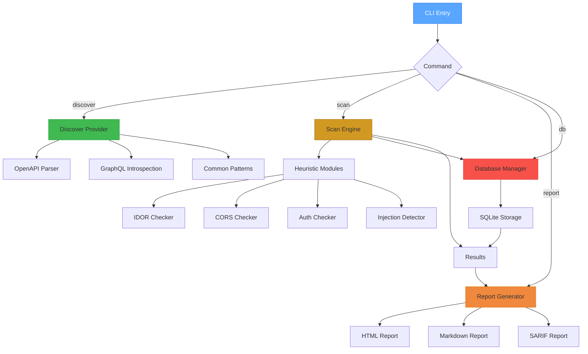

#  apihunter

[](https://pypi.org/project/apihunter/)
[](https://pypi.org/project/apihunter/)
[](https://opensource.org/licenses/MIT)
[](https://github.com/bess1lie/apihunter/actions)
[](https://codecov.io/gh/bess1lie/apihunter)
[](https://github.com/psf/black)
[](https://pycqa.github.io/isort/)
[](http://mypy-lang.org/)
[](https://github.com/PyCQA/bandit)
[](https://pypi.org/project/apihunter/)
[](https://github.com/bess1lie/apihunter/stargazers)
[](https://github.com/bess1lie/apihunter/issues)
[](https://github.com/bess1lie/apihunter/pulls)
[](https://github.com/bess1lie/apihunter)
[](https://github.com/bess1lie/apihunter)

<p align="center">
  
</p>

<p align="center">
  <strong>Professional REST API security testing CLI — OpenAPI discovery, authentication auditing, heuristic scanning, and comprehensive reporting.</strong>
</p>

<p align="center">
  <a href="#why-apihunter">Why apihunter</a> •
  <a href="#features">Features</a> •
  <a href="#architecture">Architecture</a> •
  <a href="#quick-start">Quick Start</a> •
  <a href="#configuration">Configuration</a> •
  <a href="#roadmap">Roadmap</a> •
  <a href="#contributing">Contributing</a>
</p>

## 🚀 Demo

```bash
# Discover OpenAPI endpoints
$ apihunter discover https://api.example.com
╭──────────────────── Discovered Endpoints ─────────────────────╮
│ URL                              │ Method │ Auth      │ Status │
├──────────────────────────────────┼────────┼───────────┼────────┤
│ https://api.example.com/v1/users │ GET    │ JWT       │ 200    │
│ https://api.example.com/v1/users │ POST   │ JWT       │ 201    │
│ https://api.example.com/v1/login │ POST   │ None      │ 200    │
│ https://api.example.com/v1/admin │ GET    │ JWT+RBAC  │ 403    │
╰──────────────────────────────────┴────────┴───────────┴────────╯

# Run security scan
$ apihunter scan https://api.example.com
[INFO] Starting scan on 4 endpoints...
[INFO] Testing authentication: 2 endpoints require JWT
[INFO] Testing authorization (IDOR)...
[!] 🔴 CRITICAL: IDOR vulnerability on /v1/users/{id} (GET)
[!] 🟠 HIGH: Missing rate limiting on /v1/login
[!] 🟡 MEDIUM: Verbose error message on /v1/debug
[✓] 🟢 Scan completed in 12.3s

# Generate HTML report
$ apihunter report <run_id> --format html
[✓] 🟢 Report saved to report_<run_id>.html
```

## 🧐 Why apihunter?

| Problem | Manual approach | With apihunter |
|---------|-----------------|----------------|
| **Finding OpenAPI specs** | `grep`, `curl`, guesswork across dozens of endpoints | **Automatic discovery** — detects Swagger/OpenAPI, GraphQL introspection, and common API patterns |
| **Authentication analysis** | Manual Burp testing, checking each endpoint individually | **Automated auth auditing** — identifies JWT, OAuth, Basic Auth, and missing auth |
| **Security heuristics** | Random testing, no systematic coverage | **Built-in heuristics** — IDOR, CORS misconfigurations, injection points, rate limiting |
| **Tracking findings** | Spreadsheets or scattered notes | **SQLite database** + **HTML/Markdown/SARIF** reports with severity badges |
| **CI/CD integration** | Custom scripts that break easily | **CLI-friendly** — exit codes, JSON output, and SARIF for GitHub Code Scanning |

## ✨ Features

- 🔎 **OpenAPI / Swagger Discovery** — automatically finds and parses OpenAPI 2.0/3.0, Swagger UI, and GraphQL introspection endpoints.
- 🔐 **Authentication Detection** — detects JWT, OAuth2, Basic Auth, API keys, and missing authentication.
- 🛡️ **Heuristic Security Scanning** — checks for:
  - Insecure Direct Object References (IDOR)
  - CORS misconfigurations
  - SQL/NoSQL injection points (detection only)
  - Rate limiting absence
  - Information disclosure (verbose errors, stack traces)
- 📊 **Multi‑format Reports** — HTML (interactive dashboard), Markdown (for docs), SARIF (for GitHub Code Scanning).
- 🗄️ **Local SQLite Storage** — every scan is stored, enabling historical comparison and audit trails.
- ⚙️ **Scope‑aware** — respect `scope.yaml` to focus on specific domains, paths, and exclude third‑party endpoints.
- 🧩 **Extensible** — plugin‑based architecture to add custom checks or providers.

## 🛠️ Built With

- **Language:** [Python 3.11+](https://www.python.org/)
- **CLI Framework:** [Click](https://click.palletsprojects.com/)
- **Data Models:** [Pydantic](https://docs.pydantic.dev/)
- **Database:** [SQLite](https://www.sqlite.org/)
- **HTTP Client:** [HTTPX](https://www.python-httpx.org/)
- **Validation:** [Schema](https://github.com/schematron/schema)

## 🏗️ Architecture



- **Discovery Engine**: Injects providers to probe target surfaces.
- **Scanner Engine**: Executes specialized analyzers against discovered endpoints.
- **Core**: Manages the database, HTTP client, and scope.

## 📦 Quick Start

### Installation

```bash
# From PyPI (recommended)
pip install apihunter

# Or from source (latest development)
git clone https://github.com/bess1lie/apihunter.git
cd apihunter
pip install .
```

### Basic usage

```bash
# 1. Discover endpoints
apihunter discover https://api.example.com

# 2. Run security scan (uses the latest discovery results)
apihunter scan https://api.example.com

# 3. Generate a report (HTML, Markdown, or SARIF)
apihunter report <run_id> --format html
```

## ⚙️ Configuration

Create a `scope.yaml` file to define your testing boundaries:

```yaml
scope:
  include:
    - "api.example.com"
    - "internal-api.example.com"
  exclude:
    - "cdn.example.com"
    - "*.test.example.com"

security_checks:
  - idor
  - cors
  - auth
  - injection
  - rate_limit

reporting:
  output_dir: "./reports"
  include_sources: true
  severities: ["critical", "high", "medium", "low"]
```

## 🔄 Comparison with alternatives

| Feature | apihunter | Postman | OWASP ZAP | Burp Suite | Custom scripts |
|---------|-----------|---------|-----------|------------|----------------|
| OpenAPI Discovery | ✅ | ❌ (manual) | ❌ (add‑on) | ❌ (manual) | ❌ |
| Authentication Analysis | ✅ | ❌ | ✅ | ✅ | ❌ |
| Heuristic Scanning | ✅ | ❌ | ✅ | ✅ | ❌ |
| Reports (HTML/Markdown/SARIF) | ✅ | ❌ | ✅ | ✅ | ❌ |
| CI/CD Friendly | ✅ | ❌ | ✅ | ❌ | ✅ |
| Lightweight CLI | ✅ | ❌ | ❌ | ❌ | ✅ |
| Scope‑aware | ✅ | ❌ | ❌ | ❌ | ❌ |

## 🗺️ Roadmap

| Status | Feature |
|--------|---------|
| ✅ | OpenAPI 2.0/3.0 discovery |
| ✅ | GraphQL introspection |
| ✅ | JWT / OAuth detection |
| ✅ | IDOR checker |
| ✅ | CORS checker |
| ✅ | HTML / Markdown / SARIF reports |
| ✅ | SQLite storage |
| 🚧 | Rate limiting detection |
| 🚧 | Injection point detection (SQL/NoSQL) |
| 🚧 | Plugin system for custom checks |
| 🔮 | OpenTelemetry integration |
| 🔮 | Web UI dashboard |
| 🔮 | Kubernetes operator |

## 🤝 Contributing

We welcome contributions! Please read our [Contributing Guide](CONTRIBUTING.md) and [Security Policy](SECURITY.md).

## 🛡️ Security

If you find a vulnerability, please do not report it publicly. Send an email to [your-email@example.com] or open a private issue.

## 📄 License

Distributed under the MIT License. See [LICENSE](LICENSE) for more information.

## 🌐 More Tools

- [**bounthunt**](https://github.com/bess1lie/bounthunt) – Bug bounty reconnaissance and automation.
- [**gqlhunter**](https://github.com/bess1lie/gqlhunter) – GraphQL security testing and introspection.

<p align="center">
  Made with ❤️ in Almaty · <a href="https://bess1lie.github.io">bess1lie.github.io</a>
</p>
