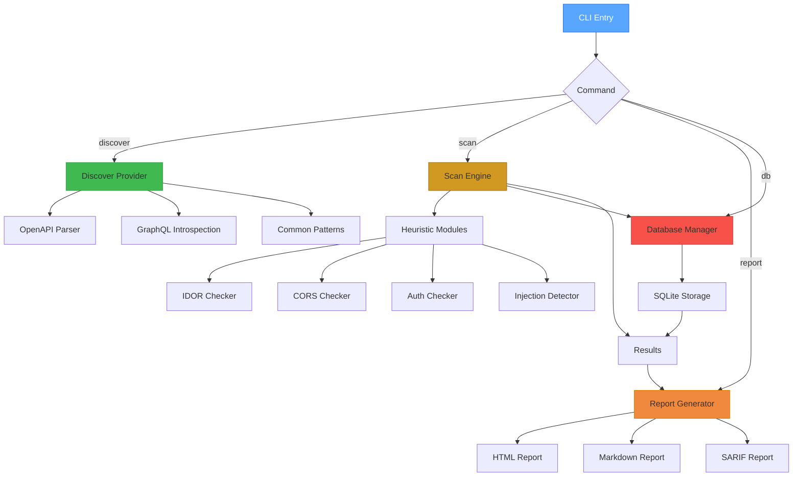

# apihunter

[](https://www.python.org/)
[](https://opensource.org/licenses/MIT)
[](https://github.com/bess1lie/apihunter/actions)
[](https://github.com/bess1lie/apihunter/stargazers)
[](https://github.com/bess1lie/apihunter/issues)

<p align="center">
  
</p>

<p align="center">
  <strong>Professional REST API security testing CLI -- OpenAPI discovery, authentication auditing, heuristic scanning, and comprehensive reporting.</strong>
</p>

<p align="center">
  <a href="#why-apihunter">Why apihunter</a> •
  <a href="#features">Features</a> •
  <a href="#architecture">Architecture</a> •
  <a href="#quick-start">Quick Start</a> •
  <a href="#configuration">Configuration</a> •
  <a href="#roadmap">Roadmap</a> •
  <a href="#contributing">Contributing</a>
</p>

## 🚀 Demo

```bash
# Discover OpenAPI endpoints
$ apihunter discover https://api.example.com
╭──────────────────── Discovered Endpoints ─────────────────────╮
│ URL                              │ Method │ Auth      │ Status │
├──────────────────────────────────┼────────┼───────────┼────────┤
│ https://api.example.com/v1/users │ GET    │ JWT       │ 200    │
│ https://api.example.com/v1/users │ POST   │ JWT       │ 201    │
│ https://api.example.com/v1/login │ POST   │ None      │ 200    │
│ https://api.example.com/v1/admin │ GET    │ JWT+RBAC  │ 403    │
╰──────────────────────────────────┴────────┴───────────┴────────╯

# Run security scan
$ apihunter scan https://api.example.com
[INFO] Starting scan on 4 endpoints...
[INFO] Testing authentication: 2 endpoints require JWT
[INFO] Testing authorization (IDOR)...
[!] 🔴 CRITICAL: IDOR vulnerability on /v1/users/{id} (GET)
[!] 🟠 HIGH: Missing rate limiting on /v1/login
[!] 🟡 MEDIUM: Verbose error message on /v1/debug
[✓] 🟢 Scan completed in 12.3s

# Generate HTML report
$ apihunter report <run_id> --format html
[✓] 🟢 Report saved to report_<run_id>.html
```

## 🧐 Why apihunter?

| Problem | Manual approach | With apihunter |
|---------|-----------------|----------------|
| **Finding OpenAPI specs** | `grep`, `curl`, guesswork across dozens of endpoints | **Automatic discovery** -- detects Swagger/OpenAPI, GraphQL introspection, and common API patterns |
| **Authentication analysis** | Manual Burp testing, checking each endpoint individually | **Automated auth auditing** -- identifies JWT, OAuth, Basic Auth, and missing auth |
| **Security heuristics** | Random testing, no systematic coverage | **Built-in heuristics** -- IDOR, CORS misconfigurations, injection points, rate limiting |
| **Tracking findings** | Spreadsheets or scattered notes | **SQLite database** + **HTML/Markdown/SARIF** reports with severity badges |
| **CI/CD integration** | Custom scripts that break easily | **CLI-friendly** -- exit codes, JSON output, and SARIF for GitHub Code Scanning |

## ✨ Features

- 🔎 **OpenAPI / Swagger Discovery** -- automatically finds and parses OpenAPI 2.0/3.0, Swagger UI, and GraphQL introspection endpoints.
- 🔐 **Authentication Detection** -- detects JWT, OAuth2, Basic Auth, API keys, and missing authentication.
- 🛡️ **Heuristic Security Scanning** -- checks for:
  - Insecure Direct Object References (IDOR)
  - CORS misconfigurations
  - SQL/NoSQL injection points (detection only)
  - Rate limiting absence
  - Information disclosure (verbose errors, stack traces)
- 📊 **Multi‑format Reports** -- HTML (interactive dashboard), Markdown (for docs), SARIF (for GitHub Code Scanning).
- 🗄️ **Local SQLite Storage** -- every scan is stored, enabling historical comparison and audit trails.
- ⚙️ **Scope‑aware** -- respect `scope.yaml` to focus on specific domains, paths, and exclude third‑party endpoints.
- 🧩 **Extensible** -- plugin‑based architecture to add custom checks or providers.

## 🛠️ Tech Stack

- **Language:** [Python 3.11+](https://www.python.org/)
- **CLI:** [Typer](https://typer.tiangolo.com/)
- **Terminal output:** [Rich](https://rich.readthedocs.io/)
- **HTTP client:** [HTTPX](https://www.python-httpx.org/)
- **Storage:** [SQLite](https://www.sqlite.org/)
- **Reports:** [Jinja2](https://jinja.palletsprojects.com/)
- **Config:** [PyYAML](https://pyyaml.org/)

## 🏗️ Architecture


```mermaid
graph TD
    A[CLI Entry] --> B{Command}
    B -->|discover| C[Discover Provider]
    B -->|scan| D[Scan Engine]
    B -->|report| E[Report Generator]
    B -->|db| F[Database Manager]
    
    C --> G[OpenAPI Parser]
    C --> H[GraphQL Introspection]
    C --> I[Common Patterns]
    
    D --> J[Heuristic Modules]
    J --> K[IDOR Checker]
    J --> L[CORS Checker]
    J --> M[Auth Checker]
    J --> N[Injection Detector]
    
    D --> F
    D --> O[Results]
    O --> E
    E --> P[HTML Report]
    E --> Q[Markdown Report]
    E --> R[SARIF Report]
    
    F --> S[SQLite Storage]
    S --> O
    
    style A fill:#58a6ff,stroke:#1f6feb,color:#fff
    style C fill:#3fb950,stroke:#2ea043
    style D fill:#d29922,stroke:#9e6a03
    style E fill:#f0883e,stroke:#d97a00
    style F fill:#f85149,stroke:#da3633
```

- **Discovery Engine**: Injects providers to probe target surfaces.
- **Scanner Engine**: Executes specialized analyzers against discovered endpoints.
- **Core**: Manages the database, HTTP client, and scope.

## 📦 Quick Start

### Installation

```bash
# From PyPI (recommended)
pip install apihunter

# Or from source (latest development)
git clone https://github.com/bess1lie/apihunter.git
cd apihunter
pip install .
```

### Basic usage

```bash
# 1. Discover endpoints
apihunter discover https://api.example.com

# 2. Run security scan (uses the latest discovery results)
apihunter scan https://api.example.com

# 3. Generate a report (HTML, Markdown, or SARIF)
apihunter report <run_id> --format html
```

## ⚙️ Configuration

Create a `scope.yaml` file to define your testing boundaries:

```yaml
scope:
  include:
    - "api.example.com"
    - "internal-api.example.com"
  exclude:
    - "cdn.example.com"
    - "*.test.example.com"

security_checks:
  - idor
  - cors
  - auth
  - injection
  - rate_limit

reporting:
  output_dir: "./reports"
  include_sources: true
  severities: ["critical", "high", "medium", "low"]
```

## 🔄 Comparison with alternatives

| Feature | apihunter | Postman | OWASP ZAP | Burp Suite | Custom scripts |
|---------|-----------|---------|-----------|------------|----------------|
| OpenAPI Discovery | ✅ | ❌ (manual) | ❌ (add‑on) | ❌ (manual) | ❌ |
| Authentication Analysis | ✅ | ❌ | ✅ | ✅ | ❌ |
| Heuristic Scanning | ✅ | ❌ | ✅ | ✅ | ❌ |
| Reports (HTML/Markdown/SARIF) | ✅ | ❌ | ✅ | ✅ | ❌ |
| CI/CD Friendly | ✅ | ❌ | ✅ | ❌ | ✅ |
| Lightweight CLI | ✅ | ❌ | ❌ | ❌ | ✅ |
| Scope‑aware | ✅ | ❌ | ❌ | ❌ | ❌ |

## 🗺️ Roadmap

| Status | Feature |
|--------|---------|
| ✅ | OpenAPI 2.0/3.0 discovery |
| ✅ | GraphQL introspection |
| ✅ | JWT / OAuth detection |
| ✅ | IDOR checker |
| ✅ | CORS checker |
| ✅ | HTML / Markdown / SARIF reports |
| ✅ | SQLite storage |
| 🚧 | Rate limiting detection |
| 🚧 | Injection point detection (SQL/NoSQL) |
| 🚧 | Plugin system for custom checks |
| 🔮 | OpenTelemetry integration |
| 🔮 | Web UI dashboard |
| 🔮 | Kubernetes operator |

## 🤝 Contributing

Pull requests are welcome. For major changes, open an issue first to discuss what you would like to change.

## 🛡️ Security

If you find a vulnerability, please report it privately to [bess1liework@gmail.com](mailto:bess1liework@gmail.com).

## 📄 License

Distributed under the MIT License. See [LICENSE](LICENSE) for more information.

## 🌐 More Tools

- [**bounthunt**](https://github.com/bess1lie/bounthunt) - Bug bounty reconnaissance and automation.
- [**gqlhunter**](https://github.com/bess1lie/gqlhunter) - GraphQL security testing and introspection.

<p align="center">
  Made with ❤️ in Almaty · <a href="https://bess1lie.github.io">bess1lie.github.io</a>
</p>
