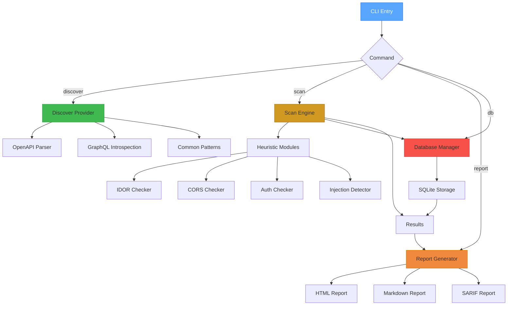

# apihunter

[](https://www.python.org/)
[](https://opensource.org/licenses/MIT)
[](https://github.com/bess1lie/apihunter/actions)
[](https://pypi.org/project/apihunter-bess1lie/)
[](https://github.com/bess1lie/apihunter/stargazers)
[](https://github.com/bess1lie/apihunter/issues)

<p align="center">
  
</p>

<p align="center">
  <strong>REST API security testing CLI — OpenAPI discovery, scope-aware scanning, heuristic checks with evidence, and SARIF/Markdown/HTML reports.</strong>
</p>

<p align="center">
  <a href="#quick-start">Quick Start</a> •
  <a href="#supported-checks">Supported Checks</a> •
  <a href="#architecture">Architecture</a> •
  <a href="#docker-lab">Docker Lab</a> •
  <a href="#example-scan">Example Scan</a> •
  <a href="#limitations">Limitations</a>
</p>

## Demo (real output, no CRITICAL hype)

```bash
$ apihunter discover https://api.example.com --scope scope.yaml
Discovered 1 specs.
  - https://api.example.com/openapi.json [high]

$ apihunter scan https://api.example.com --scope scope.yaml --profile balanced --allow-private
Run ID: 1
Found 1 specs. Parsing and scanning...

Scan completed  Duration: 2.4s
Endpoints: 5  Requests: 12  Findings: 4
HIGH: 1  MEDIUM: 1  LOW: 2  INFO: 0
┌──────────┬────────────┬─────────────────────────────────────────────┬──────────────────────┬────────────────────────┐
│ Severity │ Confidence │ Title                                       │ Endpoint             │ Evidence               │
├──────────┼────────────┼─────────────────────────────────────────────┼──────────────────────┼────────────────────────┤
│ HIGH     │ HIGH       │ CORS wildcard with credentials              │ GET /api/search      │ ACAO='*' ACAC='true'   │
│ LOW      │ LOW        │ Potential BOLA/IDOR (heuristic)             │ GET /api/users/{id}  │ status1=200 status2=.. │
│ LOW      │ LOW        │ No rate limiting observed (heuristic)       │ POST /api/login      │ statuses=[200..]       │
│ MEDIUM   │ LOW        │ Potential Information disclosure (heuristic)│ GET /api/debug       │ marker='Traceback'     │
└──────────┴────────────┴─────────────────────────────────────────────┴──────────────────────┴────────────────────────┘
Scan complete.

$ apihunter report 1 --format html -o report.html
Report saved to report.html
```

> Heuristic ≠ vulnerability. See [docs/checks.md](docs/checks.md) for confidence criteria and false-positive notes.

## Why apihunter?

| Problem | Manual approach | With apihunter |
|---------|-----------------|----------------|
| Finding OpenAPI specs | `grep`, `curl`, guesswork | Automatic discovery — 22 well-known paths + GraphQL + crawl |
| Authentication analysis | Manual Burp per endpoint | Passive + active probe with evidence |
| Security heuristics | Random testing | 8 built-in checks, each with severity/confidence/evidence |
| Tracking findings | Spreadsheets | SQLite (XDG) + HTML/Markdown/SARIF with severity badges |
| CI/CD | Custom scripts | CLI with exit codes + SARIF for GitHub Code Scanning |

## Features

- OpenAPI / Swagger Discovery — probes 22 paths (`/openapi.json`, `/swagger.json`, `/v3/api-docs`, `/graphql`…), parses OpenAPI 2.0/3.0 & Swagger `host+basePath`.
- Authentication Detection — missing `securitySchemes`, `auth_required` without schemes, sensitive paths (heuristic LOW).
- Heuristic Scanning — see [Supported Checks](#supported-checks).
- Multi-format Reports — HTML (XSS-escaped + CSP), Markdown, SARIF 2.1.0 (`properties.evidence` + `properties.confidence`).
- Local SQLite Storage — WAL + FK, parameterized, XDG `~/.local/share/apihunter/apihunter.db` (or `apihunter.db` legacy).
- Scope-aware — `allow/deny/targets/excluded_extensions` enforced on every request ([docs/scope.md](docs/scope.md)).
- Extensible — `AnalyzerContext(target, scope, client, executor)` + `AnalyzerRegistry`.

## Supported Checks

Details, evidence, and false-positive notes: [docs/checks.md](docs/checks.md).

### Direct Configuration Findings (spec/header facts — not automatically vulns)

| Check | Severity | Confidence | Evidence |
|---|---|---|---|
| `spec_security` http `servers[]` URL | MEDIUM | HIGH | `server_url='http://...' scheme=http` |
| `spec_security` missing securitySchemes | LOW | MEDIUM | `components.securitySchemes=missing` |
| `headers` Server disclosure | LOW | HIGH | `Server='nginx/1.18'` |
| `headers` Missing HSTS (https only) | MEDIUM | MEDIUM | `hsts_missing=true` |

### Heuristic Security Findings (require manual verification)

| Check | Severity | Confidence | Evidence |
|---|---|---|---|
| `idor` Potential BOLA/IDOR | LOW | LOW | `status1=200 status2=200 body_len1=... body_len2=...` — needs 2 auth contexts |
| `auth` Potentially Unauthenticated Sensitive Endpoint | LOW | LOW | `path=/admin auth_required=false` — path alone not vuln |
| `auth` Potential auth bypass (heuristic) | HIGH | MEDIUM | `status=200 body_len=... auth_required=true` — 401/403 → no finding |
| `cors` Wildcard with credentials | HIGH | HIGH | `ACAO='*' ACAC='true'` |
| `cors` Wildcard without credentials | INFO | MEDIUM | `ACAO='*'` — often intentional |
| `cors` Reflected arbitrary Origin | MEDIUM/HIGH | MEDIUM | `ACAO='https://example-attacker.invalid' Vary='...'` |
| `rate_limit` No rate limiting observed | LOW | LOW | `statuses=[200x5] no_429=true` — not a vuln alone |
| `injection` Potential SQL error | MEDIUM | LOW | `baseline_status=200 probe_status=500 matched_fragment='sql syntax'` — safe `'` probe only |
| `info_leak` Debug/admin path exposed | LOW | LOW | `path=/api/debug exposed_in_spec=true` |
| `info_leak` Information disclosure in body | MEDIUM | LOW | `marker='Traceback' snippet='...'` |

## Tech Stack

- Python 3.11+, Typer, Rich, HTTPX, SQLite, Jinja2, PyYAML

## Architecture


```mermaid
graph TD
    A[CLI Entry] --> B{Command}
    B -->|discover| C[Discover Provider]
    B -->|scan| D[Scan Engine]
    B -->|report| E[Report Generator]
    B -->|db| F[Database Manager]
    C --> G[OpenAPI Parser]
    C --> H[GraphQL Introspection]
    C --> I[Common Patterns]
    D --> J[Heuristic Modules]
    J --> K[IDOR Checker]
    J --> L[CORS Checker]
    J --> M[Auth Checker]
    J --> N[Injection Detector]
    D --> F
    D --> O[Results]
    O --> E
    E --> P[HTML Report]
    E --> Q[Markdown Report]
    E --> R[SARIF Report]
    F --> S[SQLite Storage]
    S --> O
    style A fill:#58a6ff,stroke:#1f6feb,color:#fff
    style C fill:#3fb950,stroke:#2ea043
    style D fill:#d29922,stroke:#9e6a03
    style E fill:#f0883e,stroke:#d97a00
    style F fill:#f85149,stroke:#da3633
```

- **Discovery Engine**: providers probe target surfaces (scope + concurrency + max_size).
- **Scanner Engine**: Executor (budget + scope) → parse_spec → registry → analyzers → DB.
- **Core**: HttpClient (single network point, SSRF guard, 2MB cap, redirect re-validation) + Scope + DB/Queries.

## Installation

```bash
pip install apihunter-bess1lie
apihunter --help

pipx install apihunter-bess1lie

git clone https://github.com/bess1lie/apihunter.git
cd apihunter
pip install -e .
```

## Quick Start

```bash
cat > scope.yaml <<'YAML'
allow: ["api.example.com"]
targets: ["https://api.example.com"]
YAML

apihunter discover https://api.example.com --scope scope.yaml
apihunter scan https://api.example.com --scope scope.yaml --profile balanced
apihunter report 1 --format html -o report.html
apihunter report 1 --format sarif -o apihunter.sarif
apihunter --help && apihunter version
```

> Requires `scope.yaml` — out-of-scope requests are blocked. See [scope.example.yaml](scope.example.yaml) and [docs/scope.md](docs/scope.md).

## Configuration

```yaml
allow: ["api.example.com", "*.example.com"]
deny: ["cdn.example.com"]
targets: ["https://api.example.com"]
excluded_extensions: [png, css, js]
# Optional authenticated check (prefer env var, never commit raw token):
#auth:
#  bearer_token: "${APIHUNTER_BEARER_TOKEN}"
```

All keys optional; empty = fail-closed. `allow` supports `*.` wildcards, bare domain matches subdomains. For authenticated bypass comparison, set `auth.bearer_token: "${APIHUNTER_BEARER_TOKEN}"` and `export APIHUNTER_BEARER_TOKEN="..."` — token is expanded from env, never stored in DB/reports/logs (see [docs/checks.md](docs/checks.md) — Authentication Bypass).

## Scan Profiles

| Profile | Max requests | Rate | Checks |
|---------|--------------|------|--------|
| `safe` | 10 | 2/sec | passive (auth, spec_security, info_leak) |
| `balanced` | 20 | 5/sec | + active IDOR/CORS + more |
| `aggressive` | 50 | 10/sec | all experimental (injection, rate_limit, response_headers) |

```bash
apihunter scan https://api.example.com --scope scope.yaml --profile safe
apihunter scan https://api.example.com --scope scope.yaml --profile balanced --timeout 15
apihunter scan https://api.example.com --scope scope.yaml --profile aggressive --max-requests 50
```

All profiles respect `scope.yaml`, `2MB` limit, timeout, and `allow_private=false` by default (use `--allow-private` for lab).

## Docker Lab

Isolated local lab — no external exposure, binds `127.0.0.1` only.

```bash
docker compose -f docker-compose.lab.yml up -d
curl http://127.0.0.1:8001/openapi.json  # lab spec

apihunter discover http://127.0.0.1:8001 --scope lab/scope.yaml
apihunter scan http://127.0.0.1:8001 --scope lab/scope.yaml --profile balanced --allow-private
apihunter report 1 --format html -o lab-report.html
apihunter report 1 --format sarif -o lab.sarif

docker compose -f docker-compose.lab.yml down
```

**Lab endpoints:**

| Endpoint | Scenario | Expected finding |
|---|---|---|
| `GET /api/users/{id}` | `id=1` vs `id=2` both 200, different bodies | `Potential BOLA/IDOR (heuristic)` LOW/LOW |
| `GET /api/admin` | 200 without auth (spec says auth required) | `Potential Authentication Bypass (heuristic)` HIGH/MEDIUM |
| `GET /api/debug` | `Traceback` body | `Potential Information disclosure (heuristic)` MEDIUM/LOW |
| `POST /api/login` | 5x 200 without 429 | `No rate limiting observed (heuristic)` LOW/LOW |
| `GET /api/search?q='` | `q='` → 500 + `SQL syntax` | `Potential SQL error (heuristic)` MEDIUM/LOW |
| `GET /api/protected` | `auth_required=true`, 200 without and with `lab-test-token` → both 200 | `Potential Authentication Bypass (heuristic)` HIGH/MEDIUM (with `auth.bearer_token`) |
| All | `ACAO:*` + `ACAC:true` + `Server: lab-nginx` | `CORS wildcard with credentials` HIGH/HIGH, `Server header` LOW/HIGH |

Lab is `read_only` + `tmpfs /tmp` + dedicated `lab-net` bridge. No AI, no destructive payloads.

**Authenticated bypass demo (lab):**

```bash
export APIHUNTER_BEARER_TOKEN="lab-test-token"
apihunter scan http://127.0.0.1:8001 --scope lab/scope.auth.yaml --profile balanced --allow-private
# Evidence: unauthenticated_status=200 authenticated_status=200 ... (token never stored)
```

## Example Scan

See **Demo** above. CLI summary now shows `Endpoints / Requests / Findings / Duration` + `HIGH/MEDIUM/LOW/INFO` + Rich table with `Severity | Confidence | Title | Endpoint | Evidence`. Reports include confidence and evidence; SARIF has `properties.evidence` and `properties.confidence`.

## Detection Confidence

- **HIGH:** direct fact (spec or header) — e.g. `Server: nginx`, `ACAO:*`+credentials.
- **MEDIUM:** active probe with evidence but not exploit proof — e.g. CORS reflected, auth 2xx.
- **LOW:** heuristic with insufficient context — e.g. IDOR 200 vs 200, injection 500+fragment.

Never artificially inflated. See [docs/checks.md](docs/checks.md).

## Limitations

- Heuristics are not exploits: IDOR needs 2 user tokens; rate-limit needs higher volume; injection needs code review.
- Auth `sensitive path` without `auth_required` is LOW — public endpoints may be intentional.
- CORS `*` without credentials is INFO — often intentional for public APIs.
- Missing HSTS is only reported for `https://` targets.
- Safe `'` probe only — no destructive, no blind timing.

## False Positive Caveat

> **Do not treat heuristic findings as confirmed vulnerabilities.** Every finding with `(heuristic)` in the title or `confidence: low` requires manual verification. Change severity only after you have proof (second user token, replay, code review, or server logs). Config facts (`spec_security`, `Server header`) are facts, not vulnerabilities, unless runtime confirms exposure.

## Tests

```bash
pip install -e ".[dev]"
pytest --cov --cov-report=term-missing --cov-report=xml
ruff check apihunter/ tests/
ruff format --check apihunter/ tests/
```

Coverage threshold is 80%. Tests cover positive + negative cases per analyzer (severity, confidence, evidence, no false positive) using `AsyncMock` + `respx` + `anyio`.

## Development

```bash
pip install -e ".[dev]"
pytest -q
ruff check apihunter/ tests/ --fix
mypy apihunter/ --ignore-missing-imports  # optional, not required for CI pass
```

## Comparison with alternatives

| Feature | apihunter | Postman | OWASP ZAP | Burp Suite | Custom scripts |
|---------|-----------|---------|-----------|------------|----------------|
| OpenAPI Discovery | ✅ | ❌ (manual) | ❌ (add‑on) | ❌ (manual) | ❌ |
| Authentication Analysis | ✅ | ❌ | ✅ | ✅ | ❌ |
| Heuristic Scanning (with evidence) | ✅ | ❌ | ✅ | ✅ | ❌ |
| Reports (HTML/Markdown/SARIF) | ✅ | ❌ | ✅ | ✅ | ❌ |
| CI/CD Friendly | ✅ | ❌ | ✅ | ❌ | ✅ |
| Lightweight CLI | ✅ | ❌ | ❌ | ❌ | ✅ |
| Scope‑aware | ✅ | ❌ | ❌ | ❌ | ❌ |

## Roadmap

| Status | Feature |
|--------|---------|
| ✅ | OpenAPI 2.0/3.0 discovery + crawl (robots/sitemap/HTML) |
| ✅ | GraphQL introspection (`/graphql` POST) |
| ✅ | HTML / Markdown / SARIF with confidence + evidence |
| ✅ | SQLite + scope-aware gating + executor |
| ✅ | Auth (passive + active bypass probe) |
| ✅ | IDOR/BOLA heuristic (active) |
| ✅ | CORS (active Origin probe) |
| ✅ | Rate limiting (5-probe heuristic) |
| ✅ | Injection safe probe |
| ✅ | Spec security + response headers (HSTS/CSP) |
| ✅ | Info leak (passive + active body markers) |
| ✅ | Docker security lab (localhost only) |
| 🚧 | Plugin system for custom checks |
| 🔮 | OpenTelemetry integration |

## Contributing

Pull requests welcome. For major changes, open an issue first.

## Security

If you find a vulnerability, report privately to [bess1iework@gmail.com](mailto:bess1iework@gmail.com) — see [SECURITY.md](SECURITY.md).

> **PyPI name:** `pip install apihunter-bess1lie` (import `apihunter`, CLI `apihunter`).

## License

MIT — see [LICENSE](LICENSE).

## More Tools

- [bounthunt](https://github.com/bess1lie/bounthunt)
- [gqlhunter](https://github.com/bess1lie/gqlhunter)

<p align="center">
  <sub>detection-first · scope-aware · evidence-driven · <a href="https://bess1lie.github.io">bess1lie.github.io</a></sub>
</p>
