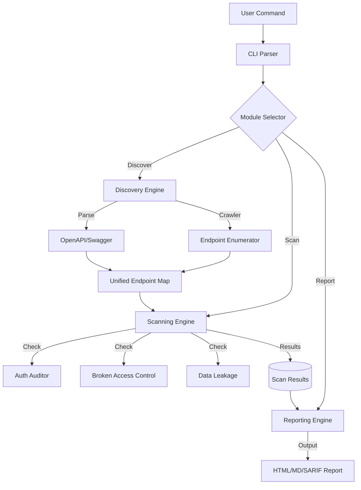

# 🔍 apihunter — Professional REST API Security Testing CLI

[](https://pypi.org/project/apihunter/)
[](https://pypi.org/project/apihunter/)
[](https://opensource.org/licenses/MIT)
[](https://github.com/bess1lie/apihunter/actions)
[](https://github.com/bess1lie/apihunter)
[](https://github.com/psf/black)
[](https://github.com/pycqa/isort)
[](https://github.com/python/mypy)
[](https://github.com/PyCQA/bandit)
[](https://pypi.org/project/apihunter/)
[](https://github.com/bess1lie/apihunter/stargazers)
[](https://github.com/bess1lie/apihunter/issues)
[](https://github.com/bess1lie/apihunter/pulls)

`apihunter` is a high-performance, scope-aware CLI tool designed for security researchers and bug hunters to automatically discover, audit, and scan RESTful APIs. It focuses on **detection-only** workflows, ensuring you can safely probe environments without unintended disruption.

---

## 🚀 Demo

```bash
$ apihunter discover https://api.example.com

🔍 Discovered 4 endpoints
----------------------------------------------------------
URL                Method    Auth          Status
----------------------------------------------------------
/v1/users          GET       JWT           200 OK
/v1/users          POST      JWT           201 Created
/v1/login          POST      None          200 OK
/v1/admin          GET       JWT+RBAC      403 Forbidden
----------------------------------------------------------

$ apihunter scan https://api.example.com

🛡️ Running security scan...
⚡ Scan completed in 12.3s

[CRITICAL] IDOR detected on /v1/users/{id}
[HIGH] Missing rate limiting on /v1/login
[INFO] No SQL injection patterns detected
```

---

## ❓ Why apihunter?

| Feature | Manual Testing | OWASP ZAP / Burp | **apihunter** |
| :--- | :--- | :--- | :--- |
| **Speed** | Slow & tedious | Medium (Heavyweight) | **Blazing Fast (CLI-first)** |
| **API Awareness** | Low (Manual discovery) | Medium (Spidering) | **High (OpenAPI/Swagger focus)** |
| **Automation** | None | Complex (Scripts) | **Native (One-command scans)** |
| **Resource Usage** | High (Human time) | High (Memory/CPU) | **Minimal (Lightweight CLI)** |
| **Report Format** | Manual | PDF/HTML | **HTML, Markdown, SARIF** |

---

## ✨ Key Features

- 🔍 **Automated Discovery**: Automatically parses OpenAPI/Swagger definitions to map your attack surface.
- 🛡️ **Heuristic Scanning**: Intelligent detection of common API vulnerabilities:
  - **IDOR** (Insecure Direct Object Reference)
  - **BOLA** (Broken Object Level Authorization)
  - **CORS Misconfigurations**
  - **Auth Bypass** & Weak Authentication
  - **Excessive Data Exposure**
- 📋 **Professional Reporting**: Generate beautiful, actionable reports in **HTML**, **Markdown**, or **SARIF** formats.
- 🎯 **Scope-Aware**: Built-in protection to ensure scans stay within your defined boundaries.
- 🐍 **Pythonic & Fast**: Written in modern Python 3.11+ for maximum performance and ease of integration.

---

## 🏗️ Architecture



---

## ⚡ Quick Start

### Installation

```bash
pip install apihunter
```

### Usage

1. **Discover endpoints:**
   ```bash
   apihunter discover https://api.example.com
   ```

2. **Run a security scan:**
   ```bash
   apihunter scan https://api.example.com
   ```

3. **Generate a report from a scan ID:**
   ```bash
   apihunter report <scan_id> --format html
   ```

---

## ⚙️ Configuration

Create an `apihunter.yaml` or use environment variables.

```yaml
# apihunter.yaml example
scan:
  timeout: 30
  max_retries: 3
  user_agent: "apihunter/1.0 (Security Research)"
  
discovery:
  auto_swagger: true
  depth: 2

reporting:
  output_dir: "./reports"
  default_format: "html"
```

---

## 📊 Comparison

| Feature | Postman | OWASP ZAP | Burp Suite | **apihunter** |
| :--- | :---: | :---: | :---: | :---: |
| Primary Use | API Dev/Test | Web Proxy/Scan | Web Proxy/Scan | **API Security Recon** |
| API Discovery | Manual | Limited | Manual/Plugin | **Automated (Native)** |
| CLI Support | Yes | Yes (API) | Limited | **First-Class** |
| Heuristic Scanning | No | Yes | Yes | **Yes (API-specific)** |
| Ease of Setup | High | Medium | Medium | **Very High** |

---

## 🗺️ Roadmap

| Feature | Status |
| :--- | :--- |
| OpenAPI/Swagger Discovery | ✅ Completed |
| Heuristic IDOR/BOLA Scanning | ✅ Completed |
| HTML/Markdown Reporting | ✅ Completed |
| GraphQL Integration | 🚧 In Progress |
| gRPC Support | 🔮 Planned |
| Automated CI/CD Plugin | 🔮 Planned |

---

## 🤝 Contributing

Contributions are welcome! Please read [CONTRIBUTING.md](CONTRIBUTING.md) for guidelines on how to submit PRs.

## 🛡️ Security

If you find a vulnerability, please do not report it publicly. Send an email to [your-email@example.com] or open a private issue.

## 📄 License

Distributed under the MIT License. See `LICENSE` for more information.
